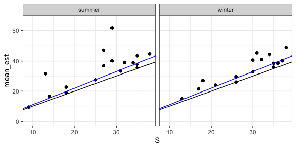

Rarefaction/estimated richness report
================

Developing a rarefaction protocol
---------------------------------

    ## Warnings: the t that defines the abundant/rare species must be smaller than number of rows in your data matrix n! 
    ##           We use t= 3 in this calculation! 
    ## 
    ## Warnings: the t that defines the abundant/rare species must be smaller than number of rows in your data matrix n! 
    ##           We use t= 3 in this calculation! 
    ## 
    ## Warnings: the t that defines the abundant/rare species must be smaller than number of rows in your data matrix n! 
    ##           We use t= 6 in this calculation! 
    ## 
    ## Warnings: the t that defines the abundant/rare species must be smaller than number of rows in your data matrix n! 
    ##           We use t= 6 in this calculation! 
    ## 
    ## Warnings: the t that defines the abundant/rare species must be smaller than number of rows in your data matrix n! 
    ##           We use t= 9 in this calculation! 
    ## 
    ## Warnings: the t that defines the abundant/rare species must be smaller than number of rows in your data matrix n! 
    ##           We use t= 9 in this calculation! 
    ## 
    ## Warnings: the t that defines the abundant/rare species must be smaller than number of rows in your data matrix n! 
    ##           We use t= 2 in this calculation! 
    ## 
    ## Warnings: the t that defines the abundant/rare species must be smaller than number of rows in your data matrix n! 
    ##           We use t= 2 in this calculation! 
    ## 
    ## Warnings: the t that defines the abundant/rare species must be smaller than number of rows in your data matrix n! 
    ##           We use t= 4 in this calculation! 
    ## 
    ## Warnings: the t that defines the abundant/rare species must be smaller than number of rows in your data matrix n! 
    ##           We use t= 4 in this calculation! 
    ## 
    ## Warnings: the t that defines the abundant/rare species must be smaller than number of rows in your data matrix n! 
    ##           We use t= 7 in this calculation! 
    ## 
    ## Warnings: the t that defines the abundant/rare species must be smaller than number of rows in your data matrix n! 
    ##           We use t= 7 in this calculation! 
    ## 
    ## Warnings: the t that defines the abundant/rare species must be smaller than number of rows in your data matrix n! 
    ##           We use t= 1 in this calculation! 
    ## 
    ## Warnings: the t that defines the abundant/rare species must be smaller than number of rows in your data matrix n! 
    ##           We use t= 1 in this calculation! 
    ## 
    ## Warnings: the t that defines the abundant/rare species must be smaller than number of rows in your data matrix n! 
    ##           We use t= 2 in this calculation! 
    ## 
    ## Warnings: the t that defines the abundant/rare species must be smaller than number of rows in your data matrix n! 
    ##           We use t= 2 in this calculation! 
    ## 
    ## Warnings: the t that defines the abundant/rare species must be smaller than number of rows in your data matrix n! 
    ##           We use t= 4 in this calculation! 
    ## 
    ## Warnings: the t that defines the abundant/rare species must be smaller than number of rows in your data matrix n! 
    ##           We use t= 4 in this calculation! 
    ## 
    ## Warnings: the t that defines the abundant/rare species must be smaller than number of rows in your data matrix n! 
    ##           We use t= 4 in this calculation! 
    ## 
    ## Warnings: the t that defines the abundant/rare species must be smaller than number of rows in your data matrix n! 
    ##           We use t= 4 in this calculation! 
    ## 
    ## Warnings: the t that defines the abundant/rare species must be smaller than number of rows in your data matrix n! 
    ##           We use t= 2 in this calculation! 
    ## 
    ## Warnings: the t that defines the abundant/rare species must be smaller than number of rows in your data matrix n! 
    ##           We use t= 2 in this calculation! 
    ## 
    ## Warnings: the t that defines the abundant/rare species must be smaller than number of rows in your data matrix n! 
    ##           We use t= 7 in this calculation! 
    ## 
    ## Warnings: the t that defines the abundant/rare species must be smaller than number of rows in your data matrix n! 
    ##           We use t= 7 in this calculation! 
    ## 
    ## Warnings: the t that defines the abundant/rare species must be smaller than number of rows in your data matrix n! 
    ##           We use t= 7 in this calculation! 
    ## 
    ## Warnings: the t that defines the abundant/rare species must be smaller than number of rows in your data matrix n! 
    ##           We use t= 7 in this calculation!

