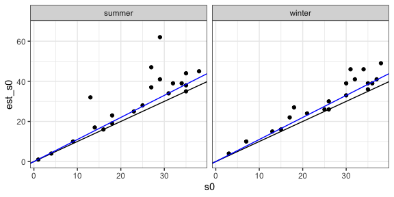

Rarefaction/estimated richness report
================

Developing a rarefaction protocol
---------------------------------

    ## [1] 62

    ## # A tibble: 6 x 8
    ##   est_datname              abund   sim source  season  year treatment  rank
    ##   <chr>                    <dbl> <dbl> <chr>   <chr>  <int> <chr>     <int>
    ## 1 dat_singles_dat_1986L_s…     8   -99 observ… summer  1986 control       1
    ## 2 dat_singles_dat_1986L_s…    33   -99 observ… summer  1986 control       2
    ## 3 dat_singles_dat_1986L_s…    65   -99 observ… summer  1986 control       3
    ## 4 dat_singles_dat_1986L_s…    88   -99 observ… summer  1986 control       4
    ## 5 dat_singles_dat_1986L_s…   141   -99 observ… summer  1986 control       5
    ## 6 dat_singles_dat_1986L_s…   145   -99 observ… summer  1986 control       6

    ## [1] 41

    ## [1] 41

    ## [1] 7

### Sensitivity of percentile to adding singletons

Is the amount of percentile change linked to the number of elements we got from the FS?

Does adding singletons change our conclusions about weirdness?
