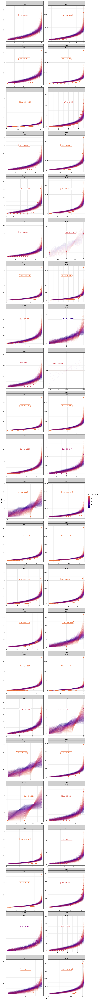

Skewness report
================

### Is skewness unique to an element of the FS?

    ## # A tibble: 48 x 5
    ##     year season treatment n_elements n_skews
    ##    <int> <chr>  <chr>          <int>   <int>
    ##  1  1986 summer control        10001   10001
    ##  2  1986 winter control        10001   10001
    ##  3  1988 summer control        10001   10001
    ##  4  1988 winter control        10001   10001
    ##  5  1991 summer control        10001   10001
    ##  6  1991 winter control        10001   10001
    ##  7  1994 summer control        10001   10001
    ##  8  1994 winter control        10001   10001
    ##  9  1995 summer control        10001   10001
    ## 10  1995 winter control        10001   10001
    ## # … with 38 more rows

Skewness is not entirely unique to an element of the FS, but you don't get re-used skews until you have extremely small feasible sets.

### Distribution of skewnesses

    ## Warning: Removed 2 rows containing non-finite values (stat_ydensity).

    ## Warning in max(data$density): no non-missing arguments to max; returning -
    ## Inf

    ## Warning: Removed 1 rows containing missing values (geom_point).

2009 is problematic because the communities are very small (S = 1 and 3, N = 2 and 5 respectively). Similarly, winter of 2000 had 12 individuals of 2 species. Notably, winter 1996 had 34 individuals of 3 species, and this appears to be enough to get some interesting variation going.

So far, this result contrasts with what I was finding earlier. Skewness is not always an incredible outlier. I am going to do this with the 1994 data to confirm that I haven't messed up somewhere.

If this holds (and perhaps even if it doesn't) perhaps it's worth re-investigating Legendre approximation over a broader set of datasets. It looks like the ones I pulled might have been unusual.

### Frequency of skewness percentiles

    ## Warning in max(filter(this_pool, skew <= observed_percentile$skew[i])
    ## $skew_rank): no non-missing arguments to max; returning -Inf

    ## Warning: Removed 1 rows containing non-finite values (stat_ydensity).

### Percentile vs S and N

    ## Warning: Removed 2 rows containing missing values (geom_point).

    ## Warning: Removed 2 rows containing missing values (geom_point).

### Heatmaps

### Relating observed skewness to S and N

