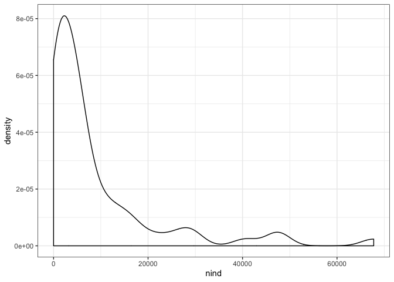

State vars report
================

``` r
  all_dat <- portalr::plant_abundance(level = "Treatment", type = "Annuals", plots = "All", unknowns = F, correct_sp = T, shape = "flat", min_quads = 16) %>%
    dplyr::filter(treatment == "control") %>%
    dplyr::select(year, species, abundance, season) %>%
    dplyr::rename(abund = abundance) %>%
  dplyr::group_by(year, season) %>%
  dplyr::arrange(abund) %>%
    dplyr::mutate(rank = dplyr::row_number()) %>% 
  dplyr::ungroup() %>%
  dplyr::select(-species) %>%
  dplyr::mutate(sim = -99,
                  source = "observed")
```

    ## Loading in data version 1.127.0

``` r
all_dat <- all_dat %>%
  group_by(year, season) %>%
  summarize(nspp = max(rank),
            nind = sum(abund)) %>%
  ungroup()
  
statevar_plot <- ggplot(data = all_dat, aes(x = nspp, y = nind, label = year, color = season)) +
  geom_label() +
  theme_bw() +
  scale_color_viridis_d(end = .6)

statevar_plot
```


``` r
nind_hist <- ggplot(data = all_dat, aes(x = nind)) +
  geom_density() +
  theme_bw()

nind_hist
```



``` r
nspp_hist <- ggplot(data = all_dat, aes(x = nspp)) +
  geom_density() +
  theme_bw()

nspp_hist
```


``` r
small_years <- all_dat %>%
  filter(nspp <= 40,
         nind <= 15000) %>%
  group_by(year) %>%
  summarize(nb_seasons = n()) %>%
  ungroup() %>%
  filter(nb_seasons == 2)

small_years_dat <- all_dat %>%
  filter(year %in% small_years$year)

small_statevar_plot <- ggplot(data = small_years_dat, aes(x = nspp, y = nind, label = year, color = season)) +
  geom_label() +
  theme_bw() +
  scale_color_viridis_d(end = .6)

small_statevar_plot
```


``` r
small_years_dat
```

    ## # A tibble: 38 x 4
    ##     year season  nspp  nind
    ##    <int> <chr>  <int> <int>
    ##  1  1986 summer    11  3204
    ##  2  1986 winter    23  6385
    ##  3  1988 summer    11  5110
    ##  4  1988 winter    23  9922
    ##  5  1991 summer    24  9953
    ##  6  1991 winter    28  1690
    ##  7  1994 summer    10    60
    ##  8  1994 winter    27  4742
    ##  9  1995 summer    17   704
    ## 10  1995 winter    33 11869
    ## # … with 28 more rows

\`\`\`
